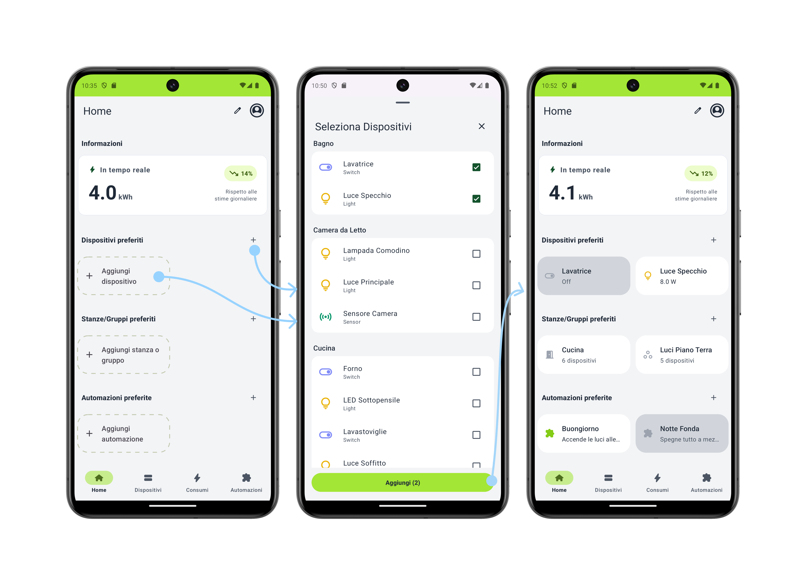
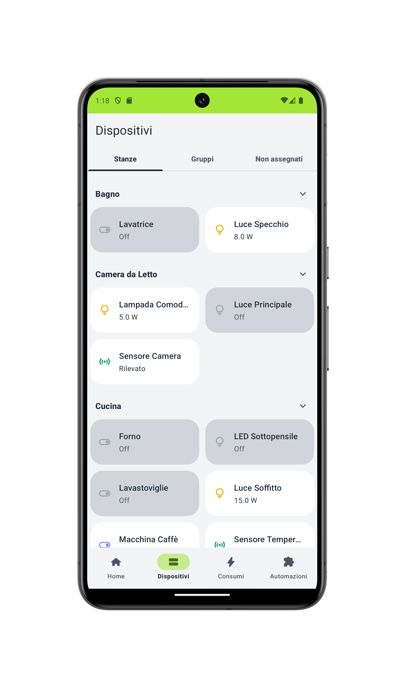
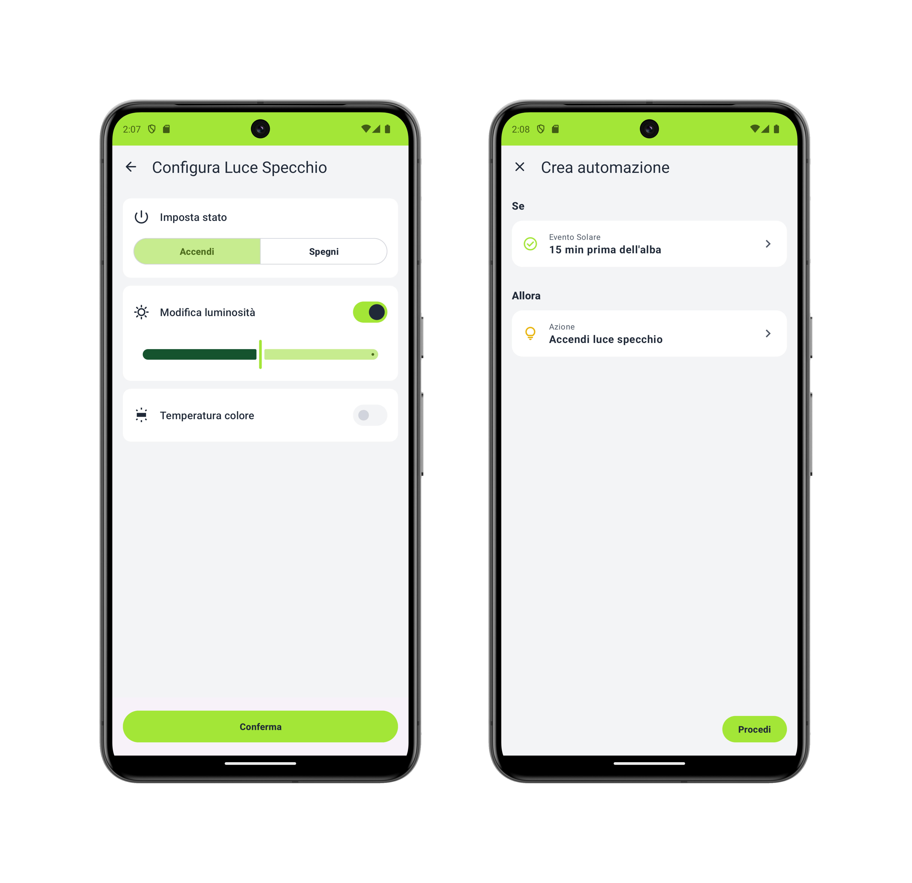
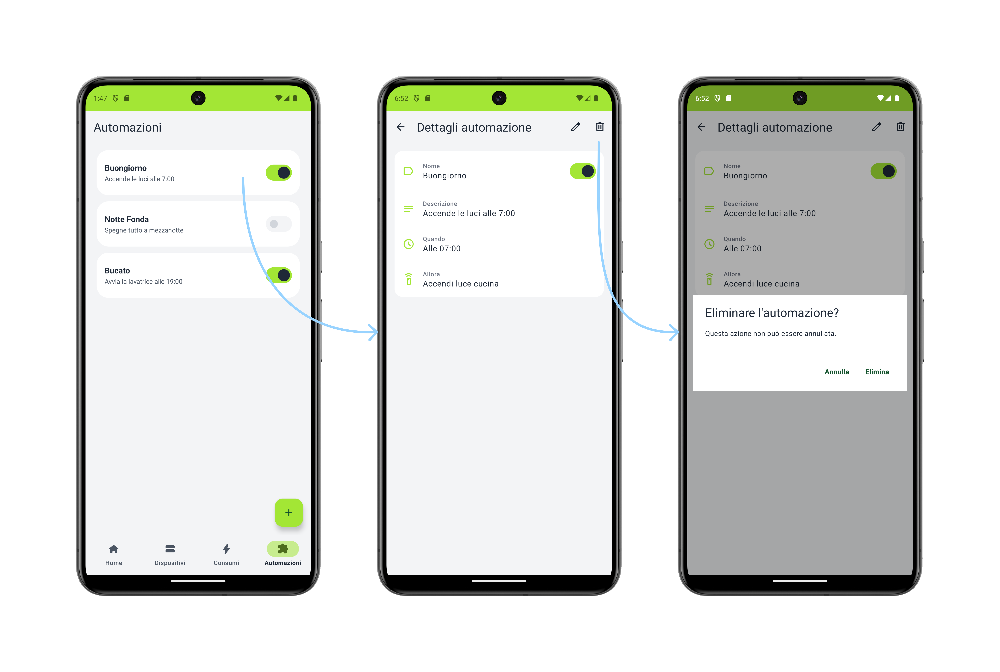

# App-DT: Green Smart Home Digital Twin

## Title & Elevator Pitch
A native Android application designed to revolutionize domestic energy management through a *user-in-the-loop* approach. By interfacing with a household Digital Twin, the app moves beyond typical "blind" home automation concepts by enabling a "What-If" simulation layer. Users can prospectively evaluate the energetic impact of their actions before execution, preventing power overloads and waste in real-time.

## Tech Stack
- **Language:** Kotlin
- **UI Framework:** Android ViewBinding, XML layout, Navigation Component
- **Asynchrony & State Management:** Kotlin Coroutines, StateFlow / SharedFlow
- **Dependency Injection:** Dagger Hilt
- **Storage & Data:** DataStore Preferences / Retrofit

## Architecture & Design Patterns
The project is strictly engineered around **Clean Architecture** principles to guarantee maximum scalability and maintainability, isolating business logic from the UI application framework.
- **Domain Layer & Use Cases:** Transactional logic and Digital Twin mediation (e.g., CheckAuthStateUseCase, simulation handling) are fully encapsulated into independent, framework-agnostic Use Cases.
- **MVVM Pattern:** Highly reactive, data-driven user interfaces. ViewModels expose and manage UI and state flows primarily via StateFlow.
- **DI Modularization:** Distinct Dagger Hilt separation into scalable modules (NetworkModule, RepositoryModule, DataSourceModule), enabling high testability of the domain and data layer.

## Key Achievements & Challenges
- **Asynchronous "What-If" Simulation Architecture:** The core engineering challenge transitioned away from traditional unidirectional domotic triggers (trigger -> execution). Instead, a *Draft Validation* logic was engineered: user automations are formulated as "intentions" passed to the Digital Twin. The system asynchronously simulates the power load, predicting peaks and generating a custom negotiation UI to resolve dynamic energy conflicts on the fly.
- **Usability & Effectiveness Metrics:** The delicate balance between predictive algorithmic complexity and UX returned exceptional metrics during real-world testing:
  - **Excellent SUS Score:** **87.0 / 100**, heavily outperforming the baseline sector average (68).
  - **Operational Success Rate:** **100%** completion rate on standard home-automation relational tasks.
  - **Conflict Resolution Handling:** An **80%** user success rate on resolving complex "Energy Overload Conflicts" artificially generated by the system's runtime layer.

## Local Setup & Installation
1. Clone the repository: git clone <repository-url>
2. Open the project in **Android Studio**.
3. Allow Gradle to complete the sync (JDK 17 required, Target SDK 35).
4. Run the app on an Emulator or Physical Device running Android 14+ (Min SDK 34).

## UI / Demo

Here are some preview screenshots from the application showcasing the user interface and the core workflow functionalities:

### Dashboard & Device Grid

  
  

### What-If Automation & Conflict Dialog

  
  

